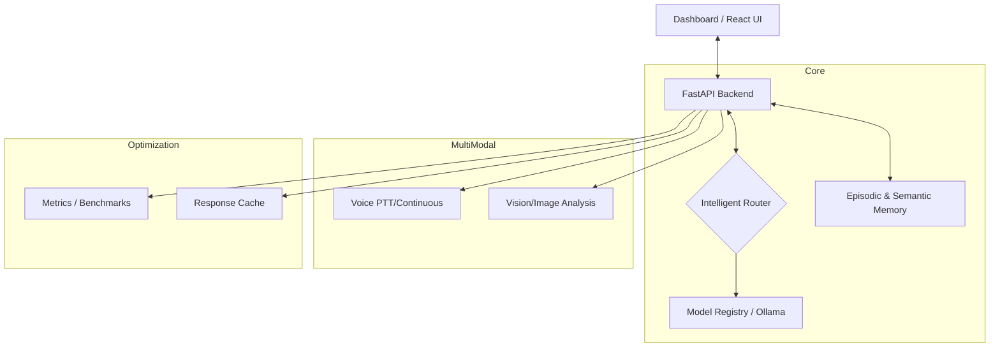

# NOVA Agent — Multimodal AI Assistant 🚀


NOVA is a professional, local-first multimodal AI assistant that intelligence routes queries between specialized models. It features advanced vision analysis, voice interactivity, and persistent memory layers.

## 🏗️ System Architecture



For a deeper dive into routing, caching, and model fallbacks, see [docs/ARCHITECTURE.md](docs/ARCHITECTURE.md).

## 🚀 Key Features
- **Cerebral Routing**: Dynamically selects the best LLM (Mixtral for logic, Dolphin for speed, Moondream for vision).
- **🖼️ Multimodal Vision**: End-to-end analysis of images using LLaVA/Moondream.
- **🗣️ Advanced Voice**: Push-to-Talk and continuous active listening modes.
- **🧠 Hybrid Memory**: Combines Episodic (SQLite) and Semantic memory for persistent personality and fact retention.
- **🎨 UI Cyberpunk**: Modern, reactive interface with real-time metadata panel and metrics dashboard.
- **🛡️ Local-First**: 100% private execution via Ollama integrations.

## 🛠️ Quick Start

### Prerequisites
- [Ollama](https://ollama.ai/) installed and running.
- Python 3.10+
- Required Models: `llava:7b`, `moondream`, `dolphin-mistral:7b`, `mixtral:8x7b`.

### Installation
```bash
# Clone the repository
git clone https://github.com/MerariJafet/NOVA_Agent
cd NOVA_Agent

# Install dependencies
pip install -r requirements.txt

# Start NOVA
python nova.py start
```

## 📡 API Endpoints

| Endpoint | Method | Description |
|----------|--------|-------------|
| `/api/chat` | POST | Conversational chat with intelligent routing. |
| `/api/upload` | POST | Upload image for vision analysis. |
| `/api/status` | GET | Check system operational status. |
| `/api/metrics/full` | GET | Retrieve system performance metrics. |

## 📊 Benchmarks & Proof of Impact

| Metric | Accuracy / Latency | Condition |
|--------|-------------------|-----------|
| **Routing Accuracy** | TBD | Measure vs categorical gold set |
| **P90 Latency (Chat)** | TBD | Measurement on RTX 3060 / 16GB |
| **Cache Hit Ratio** | TBD | Measurement over 100 repetitive queries |

See [docs/BENCHMARKS.md](docs/BENCHMARKS.md) for the reproducible measurement methodology.

## 📈 Roadmap
- [x] v0.1.0: Basic Cerebral Routing & Stabilization.
- [x] v1.0.0: Multimodal Integration (Vision/Voice) & CI Pipeline.
- [ ] v1.1.0: Real-time RAG (Retrieval Augmented Generation) with Vector DB.
- [ ] v2.0.0: Autonomous Tool-Calling Agents (Action Layer).

## 📄 License
MIT License. See [LICENSE](LICENSE) for details.

---
**NOVA Agent** - *The future of local-first intelligent assistance.* 🤖✨
